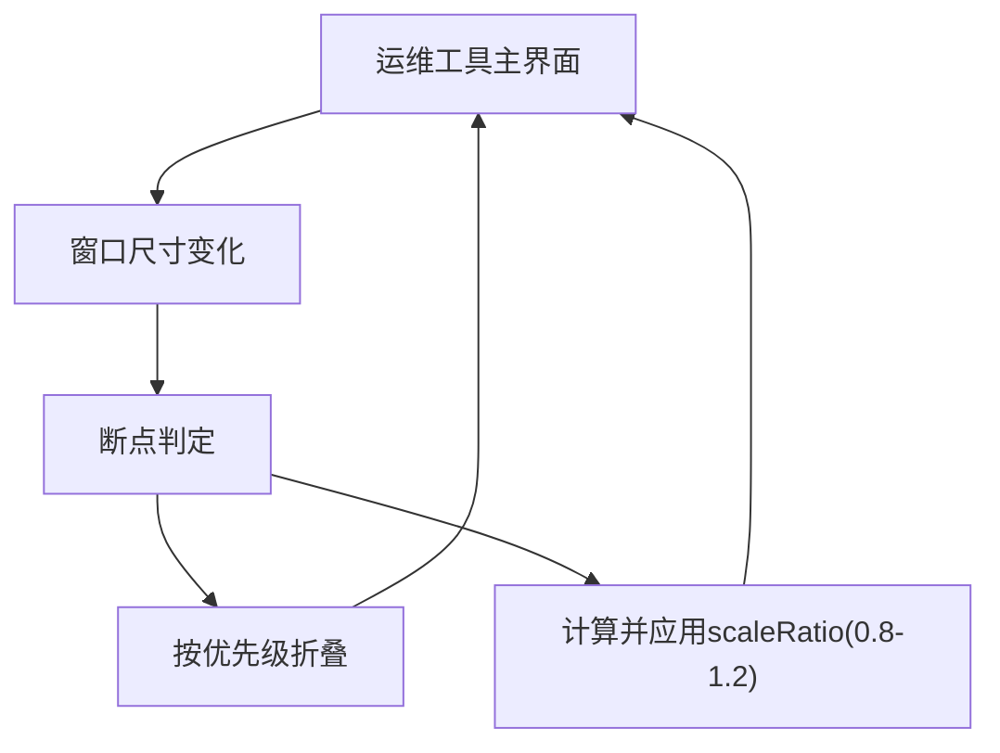

## 1. Product Overview
运维工具界面在不同窗口尺寸下保持可用、信息清晰，并提供可控的动态缩放。
在最小窗口 800×600 下仍能完成核心操作，且缩放比例限制为 0.8–1.2。

## 2. Core Features

### 2.1 Feature Module
本工具的需求由以下页面构成：
1. **运维工具主界面**：顶部操作区、侧边导航、主内容区、状态/提示区、自适应布局与动态缩放。

### 2.2 Page Details
| Page Name | Module Name | Feature description |
|-----------|-------------|---------------------|
| 运维工具主界面 | 自适应布局 | 根据窗口宽高与断点切换布局（列数/面板可见性/导航形态），最小窗口 800×600 可用。 |
| 运维工具主界面 | 动态缩放 | 根据窗口尺寸计算 scaleRatio，并限制在 0.8–1.2；缩放不足以容纳内容时，按折叠优先级规则折叠非关键区域。 |
| 运维工具主界面 | 折叠优先级 | 定义可折叠区域与优先级：先折叠非关键辅区，再折叠菜单表现形态，最后才允许出现滚动（不低于 0.8）。 |
| 运维工具主界面 | 状态提示 | 在窗口尺寸低于最小要求（<800×600）时给出明确提示（例如“窗口过小，请放大”），并阻止继续缩小导致不可用。 |

## 3. Core Process
- 你打开运维工具主界面后，界面会读取当前窗口尺寸并应用对应断点布局。
- 你拖拽调整窗口大小时，界面实时计算 scaleRatio（限制 0.8–1.2），并按折叠优先级逐步隐藏/折叠低优先级区域。
- 当窗口尺寸小于 800×600 时，界面提示窗口过小并保持可交互的最小可用布局（不再继续压缩信息密度）。

