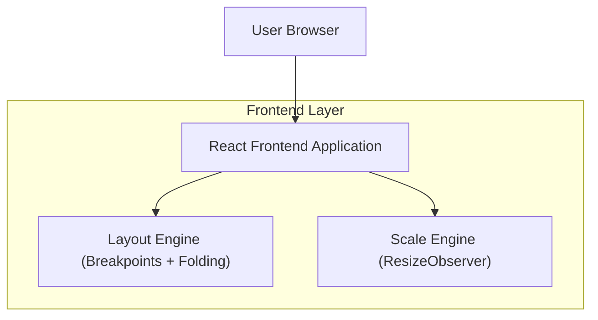

## 1.Architecture design

## 2.Technology Description
- Frontend: React@18 + TypeScript + tailwindcss@3（或等价 CSS 方案）
- Backend: None

## 3.Route definitions
| Route | Purpose |
|-------|---------|
| / | 运维工具主界面：承载自适应布局与动态缩放策略 |

## 6.Data model(if applicable)
无（本方案仅定义界面布局与缩放策略）。

---

## 附：自适应布局与动态缩放方案（可直接落地）

### A. 最小窗口约束
- 最小可用窗口：**800×600**（低于该值进入“窗口过小”保护态：提示 + 禁止进一步压缩信息密度）。

### B. 断点定义（桌面优先）
以窗口可视区域（Viewport）宽度为主，辅以高度阈值。

**宽度断点**
| Breakpoint | Range (px) | Layout intent |
|---|---:|---|
| XL | >= 1440 | 三栏/富信息：侧边导航 + 主内容 + 辅助面板（如详情/帮助） |
| L | 1200–1439 | 两栏：侧边导航 + 主内容（辅助面板默认折叠为抽屉/弹层） |
| M | 960–1199 | 两栏紧凑：侧边导航可切换“图标模式”，主内容优先 |
| S | 800–959 | 单栏优先：侧边导航默认收起为抽屉；主内容单列 |
| <S | <800 | 不支持：进入保护态提示 |

**高度阈值（用于决定纵向密度）**
| Height Level | Range (px) | Rule |
|---|---:|---|
| H2 | >= 800 | 正常密度：可显示更多表格行/日志行 |
| H1 | 600–799 | 紧凑密度：减少留白、缩短列表默认可视行数 |
| <H1 | <600 | 不支持：进入保护态提示 |

### C. scaleRatio 计算与约束（0.8–1.2）
- 目标：在不牺牲可读性的前提下，允许适度缩放以提升“同屏信息量”或在略小窗口保持整体比例。
- 约束：**scaleRatio ∈ [0.8, 1.2]**。

**推荐算法（同时考虑宽高，优先保证不溢出）：**
- 设定一个“设计参考尺寸”作为缩放基准（建议做成可配置项，例如 `DESIGN_VIEWPORT_BASE_WIDTH/HEIGHT`）。
- 计算：
  - `rw = viewportWidth / baseWidth`
  - `rh = viewportHeight / baseHeight`
  - `raw = min(rw, rh)`
  - `scaleRatio = clamp(0.8, raw, 1.2)`

**与断点/折叠的关系（关键规则）：**
1. 先按断点决定布局形态（列数、面板开合、导航形态）。
2. 再计算并应用 scaleRatio。
3. 若 `raw < 0.8`（理论上需要更小缩放才能容纳）：
   - 强制 `scaleRatio = 0.8`；
   - 继续触发折叠优先级规则；
   - 最后手段才允许局部滚动（避免整体缩到不可读）。

### D. 折叠优先级规则（从先到后）
定义“不可折叠（P0）”与“可折叠（P1–P4）”区域，窗口变小时按优先级逐级折叠。

| Priority | Area / Pattern | Folding rule |
|---:|---|---|
| P0 | 顶部关键操作（主动作按钮、环境选择等）、主内容标题与筛选 | 永远可见；必要时进入紧凑样式（按钮变小、文字省略号） |
| P1 | 辅助面板（右侧详情/帮助/说明） | 侧栏 -> 抽屉 -> 弹层；默认不占用主内容宽度 |
| P2 | 次要信息区（统计卡片、次级标签页、说明区块） | 变为可折叠 Accordion；默认收起 |
| P3 | 左侧导航 | 宽导航 -> 图标导航 -> 抽屉导航；在 S 断点默认抽屉 |
| P4 | 非关键装饰与冗余信息（引导文案、次要提示） | 直接隐藏；仅保留必要提示入口 |

### E. 保护态（<800×600）
- 展示遮罩/横幅提示：“窗口过小，请调整到至少 800×600”。
- 保持最小交互：允许你关闭提示后继续查看，但不再进一步降低密度/缩放比（避免不可用）。

### F. 实现要点（前端）
- 监听尺寸：`ResizeObserver`（建议监听根容器）或 `window.onresize`（备用）。
- 缩放应用：推荐使用 CSS 变量 `--scale` + `transform: scale(var(--scale))`（并设置 `transform-origin: top left`）。
- 布局：优先用 CSS Grid / Flex 做“真响应式”，缩放只用于微调同屏密度（避免纯缩放导致文字可读性问题）。
